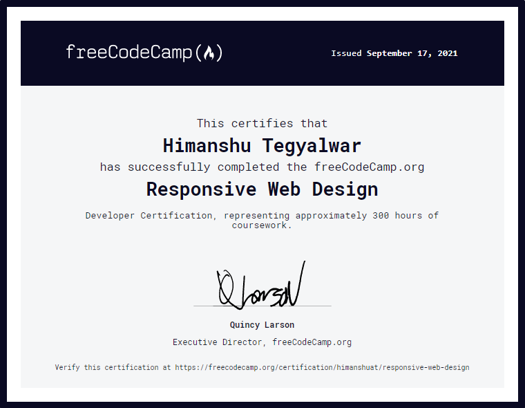

# RESPONSIVE WEB DESIGN

Solutions of Projects of [Responsive Web Design](https://www.freecodecamp.org/learn/responsive-web-design/) course by [freecodecamp](https://freecodecamp.org)

[**Certificate of Completion**](https://www.freecodecamp.org/certification/himanshuat/responsive-web-design)

## PROJECTS

1. **Tribute Page** 
    * [Pen Link](https://codepen.io/himanshuat/pen/PomxQLx)
    * [Live Site](https://codepen.io/himanshuat/full/PomxQLx)
2. **Survey Form**
    * [Pen Link](https://codepen.io/himanshuat/pen/VwbVQNQ)
    * [Live Site](https://codepen.io/himanshuat/full/VwbVQNQ)
3. **Product Landing Page**
    * [Pen Link](https://codepen.io/himanshuat/pen/GRErzvQ)
    * [Live Site](https://codepen.io/himanshuat/full/GRErzvQ)
4. **Technical Documentation Page**
    * [Pen Link](https://codepen.io/himanshuat/pen/gORRPZp)
    * [Live Site](https://codepen.io/himanshuat/full/gORRPZp)
5. **Personal Portfolio**
    * [Pen Link](https://codepen.io/himanshuat/pen/bGRYbap)
    * [Live Site](https://codepen.io/himanshuat/full/bGRYbap)

## CERTIFICATE

