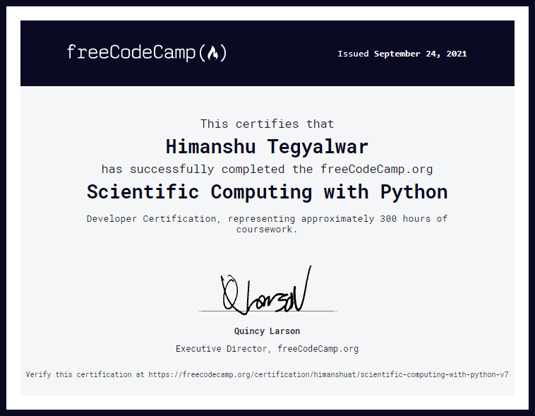

# SCIENTIFIC COMPUTING WITH PYTHON

Solutions of Projects of [Scientific Computing with Python](https://www.freecodecamp.org/learn/scientific-computing-with-python/) course by [freecodecamp](https://freecodecamp.org)

[**Certificate of Completion**](https://www.freecodecamp.org/certification/himanshuat/scientific-computing-with-python-v7)

## PROJECTS

1. [Arithmetic Formatter](https://github.com/himanshuat/freecodecamp-projects/tree/main/Scientific%20Computing%20with%20Python/Arithmetic%20Formatter)
2. [Time Calculator](https://github.com/himanshuat/freecodecamp-projects/tree/main/Scientific%20Computing%20with%20Python/Time%20Calculater)
3. [Budget App](https://github.com/himanshuat/freecodecamp-projects/tree/main/Scientific%20Computing%20with%20Python/Budget%20App)
4. [Polygon Area Calculator](https://github.com/himanshuat/freecodecamp-projects/tree/main/Scientific%20Computing%20with%20Python/Polygon%20Area%20Calculator)
5. [Probability Calculator](https://github.com/himanshuat/freecodecamp-projects/tree/main/Scientific%20Computing%20with%20Python/Probability%20Calculator)

**`DO LEAVE A ⭐ IF YOU FOUND IT USEFUL`**

## CERTIFICATE

